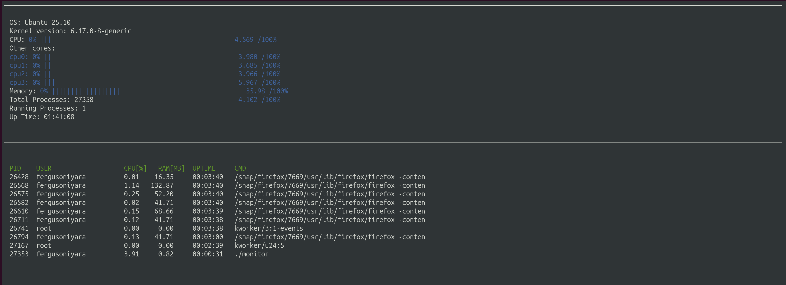

# Linux System Monitor

A real-time system monitoring application for Linux, built in C++. This project provides a terminal-based interface similar to `htop` that displays system information including CPU usage, memory utilization, and running processes.



## Features

- **CPU Monitoring**: Real-time CPU utilization percentage for overall system and individual cores
- **Memory Tracking**: Current memory usage displayed as percentage and visual progress bar
- **Process Information**: Top 10 processes sorted by resource usage, showing:
  - Process ID (PID)
  - User
  - CPU percentage
  - RAM usage (MB)
  - Uptime
  - Command
- **System Information**: OS name, kernel version, system uptime
- **Process Statistics**: Total and running process counts
- **Auto-refresh**: Updates every second for real-time monitoring

## Architecture

The project is organized into several key components:

- **ProcessParser** (`src/process_parser.cpp`): Parses Linux `/proc` filesystem to extract system and process information
- **SysInfo** (`src/sys_info.cpp`): Aggregates and manages system-level statistics (CPU, memory, uptime)
- **Process** (`src/process.cpp`): Represents individual process with its attributes
- **ProcessContainer** (`src/process_container.cpp`): Manages collection of processes and refresh logic
- **ncurses Display** (`src/main.cpp`): Terminal UI rendering using ncurses library
- **Utilities** (`src/util.cpp`, `src/format.cpp`): Helper functions for formatting and file I/O

## Requirements

- **Operating System**: Linux (uses `/proc` filesystem)
- **Compiler**: C++17 compatible compiler (GCC 7+ or Clang 5+)
- **Libraries**:
  - ncurses library for terminal UI
  - CMake 2.6 or higher

### Installing ncurses

On Ubuntu/Debian:
```bash
sudo apt install libncurses5-dev libncursesw5-dev
```

On Fedora/RHEL:
```bash
sudo dnf install ncurses-devel
```

## Build Instructions

This project uses CMake and Make for building.

### Available Make Targets

- `make build` - Compiles the source code and generates the executable
- `make format` - Applies ClangFormat to style the source code
- `make debug` - Compiles with debugging symbols enabled
- `make clean` - Removes the `build/` directory and all build artifacts

### Building the Project

1. Clone the repository:
```bash
git clone <repository-url>
cd System-Monitor-Project
```

2. Build the project:
```bash
make build
```

3. Run the monitor:
```bash
./build/monitor
```

The application will launch in your terminal and begin displaying real-time system information.

## Implementation Details

### Data Sources

The application reads system information from Linux `/proc` filesystem:

- `/proc/stat` - CPU statistics
- `/proc/meminfo` - Memory usage
- `/proc/uptime` - System uptime
- `/proc/version` - Kernel version
- `/proc/[pid]/stat` - Process-specific CPU and timing data
- `/proc/[pid]/status` - Process memory and user information
- `/proc/[pid]/cmdline` - Process command line

### CPU Calculation

CPU utilization is calculated by measuring the difference in active and idle time between successive reads of `/proc/stat`, using the formula:

```
CPU % = 100 * (active_diff / (active_diff + idle_diff))
```

### Process Monitoring

The application monitors all running processes and displays the top 10 by resource usage. Each process is updated every refresh cycle to show current CPU and memory consumption.

## Project Structure

```
.
├── CMakeLists.txt          # CMake build configuration
├── Makefile                # Make targets for build automation
├── README.md               # This file
├── include/                # Header files
│   ├── constants.h
│   ├── format.h
│   ├── linux_parser.h
│   ├── ncurses_display.h
│   ├── process.h
│   ├── process_container.h
│   ├── process_parser.h
│   ├── processor.h
│   ├── sys_info.h
│   ├── system.h
│   └── util.h
└── src/                    # Source files
    ├── format.cpp
    ├── linux_parser.cpp
    ├── main.cpp
    ├── ncurses_display.cpp
    ├── process.cpp
    ├── process_container.cpp
    ├── process_parser.cpp
    ├── processor.cpp
    ├── sys_info.cpp
    ├── system.cpp
    └── util.cpp
```

## License

This project is part of the C++ Bootcamp curriculum.